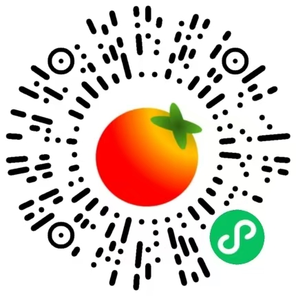

# 时间领航员微信小程序

这是一个使用番茄工作法帮助用户提高专注度和效率的微信小程序。

## ✨ 主要功能

*   **番茄钟计时器**:
    *   支持自定义专注时长、短休息时长、长休息时长。
    *   提供开始、暂停、重置计时功能。
    *   支持三种计时模式：专注、短休息、长休息。
    *   提供多种计时器外观样式（如圆形进度条、线性进度条、极简模式）。
    *   可选配计时结束提示音和震动反馈。
*   **任务管理**:
    *   创建、编辑和删除任务。
    *   将任务与番茄钟关联，追踪特定任务的专注时间。
    *   标记任务完成状态。
*   **数据统计**:
    *   记录每日/每周完成的番茄数量。
    *   统计每日/每周的总专注时长。
    *   提供图表化展示（例如，专注时段分布）。
*   **个性化设置**:
    *   自定义主题颜色。
    *   配置自动开始下一个专注或休息时段。
    *   调整长休息的间隔番茄数。
    *   选择计时器样式。

## 🚀 如何使用

1.  在微信中搜索"时间领航员"并打开。
2.  或者，使用微信开发者工具导入项目：
    *   克隆或下载此仓库。
    *   打开微信开发者工具。
    *   选择"导入项目"。
    *   选择项目目录，并填入您的 AppID（如果需要）。
    *   点击"导入"。
3.  在"专注"页面开始您的第一个番茄钟。
4.  在"任务"页面管理您的待办事项。
5.  在"统计"页面查看您的专注记录。
6.  在"设置"页面根据您的喜好进行个性化配置。

## 💻 技术栈

*   **前端**: 微信小程序原生框架 (WXML, WXSS, JavaScript)
*   **开发工具**: 微信开发者工具, Cursor

## 🤝 贡献

欢迎提交 Pull Request 或 Issue 来改进这个项目。

## 📄 License

---

*该项目全程使用 [Cursor](https://cursor.sh/) AI 编程助手开发。 初次深度体验 AI 辅助编程，其效率和能力令人震撼！* 

---

### 更新：

番茄时钟的任务页面支持新建任务时，新建更加详细的内容，并且添加编辑、删除、排序等功能。新加背景音乐功能和游戏化成就系统。